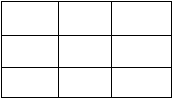
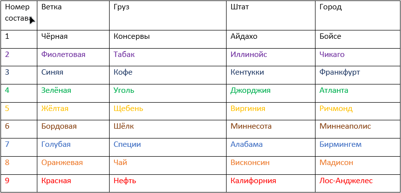
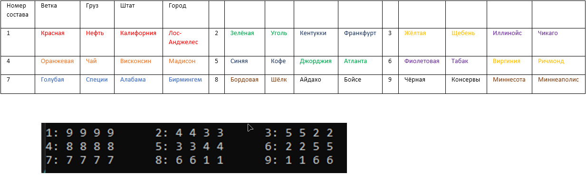

# Программа для решения логической Загадки Эйнштейна (Zebra Puzzle) по курсу математической логики

#
https://w.wiki/4RSw
#
Решение реализовано стандартными средствами языка C++ и библиотекой для построени бинарных деревьев решений (BDD - Binary Decision Diagram) BuDDy.
#
Задача сформулирована так, что имеет только одно решение.
Формулировка задачи:

На таможню поступили 9 составов.
Относительное друг друга они расположены следующим образом.

Каждый состав перевозит один уникальный груз, прибыл по уникальной ветке, из уникального штата, начав свой путь из уникального города. 
После растаможивания расположение составов изменилось и имеет следующий вид.

#
Вам необходимо определить из какого штата из какого города по какой ветке и с каким грузом прибыли составы до растаможивания. Известно следующее:

Ограничения первого типа(cond1 в коде)
1.	Первый состав прибыл по Красной ветке.
2.	Второй состав прибыл по Зелёной ветке
3. 	Третий состав прибыл по синей ветке 
4. 	Восьмой состав перевозит чай
5. 	Седьмой состав следовал из штата Алабама
6.	Девятый состав начинал свой путь в Миннеаполис
7.	Девятый состав прибыл по Чёрной ветке 
8.	Пятый состав прибыл по Синей ветке
9.	Второй состав перевозит уголь
10.	Четвертый состав следовал из штата Висконсин
11.	Шестой состав начинал свой путь в городе Ричмонд
12.	Девятый состав следовал из штата Миннесота
13.	Первый состав начинал свой путь в городе Лос-Анджелес

Ограничения второго типа(cond2 в коде)
3) 	Состав, который следовал из штата Висконсин перевозит чай
4) 	Состав, который начинал свой путь в городе Атланта следовал из штата Джорджия
5)	Состав, который перевозит специи прибыл по Голубой ветке
6) 	Состав, который следовал из штата Иллинойс прибыл по Жёлтой ветке
7) 	Состав, который начинал свой путь в городе Бойсе перевозит шёлк
8) 	Состав, который перевозит табак прибыл по Фиолетовой ветке 

Ограничения третьего типа(cond3 в коде)
9)	Состав, который начинал свой путь в городе Франкфурт находился сверху-справа от состава, который перевозит чай
10) Состав, который следовал из штата Миннесота находился снизу-справа от состава, который прибыл по Синей ветке
11) Состав, который перевозит кофе находился сверху-справа от состава, который прибыл по Голубой ветке
12)	Состав, который следовал из штата Айдахо находился выше состава, который следовал из штата Висконсин
13)	Состав, который прибыл по Фиолетовой ветке находился снизу-справа от состава, который перевозит уголь

Ограничения четвертого типа(cond4 в коде)
14)	Состав, который прибыл по Синей ветке находился рядом с составом, который перевозит щебень
15)	Состав, который начинал свой путь в городе Мадисон находился рядом с составом, который прибыл по Зелёной ветке
16)	Состав, который прибыл по Голубой ветке находился рядом с составом, который прибыл по Синей ветке 	 
#
Список рекомендуемой литературы:
1)	А.Б.Беляев, И.В. Шошмина Использование бинарных решающих диаграмм для решения логических задач. Библиотека BuDDy. 2014 г.
2)	Ю.Г.Карпов Курс математической логики https://courses.openedu.ru/courses/course1:spbstu+MATLOG+fall_2020/course/ 
3)	Документация библиотеки BuDDy http://buddy.sourceforge.net/manual/main.html 
4)	Задачи планирования и программирование в ограничениях / Хабр. https://habr.com/company/billing/blog/342550/
5)	BuDDy – latest version. https://sourceforge.net/projects/buddy/

#
Ответ, полученный при помощи программы:

